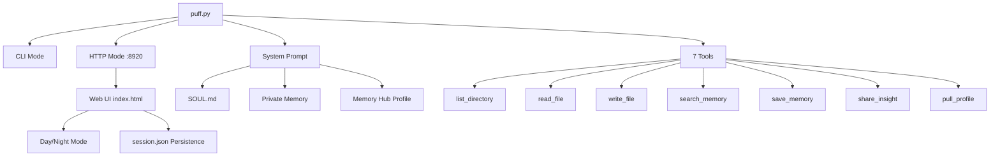

# Puff — Creative Director AI Agent

> A standalone AI agent with personality. Writes. Reads your drafts. Remembers your preferences.
> Has its own Web UI, file system access, and 7 function-calling tools.

[](https://python.org)
[-brightgreen)]()
[](LICENSE)
[](https://github.com/Zhu070124)

> Part of the Paofu AI ecosystem — the creative personality layer. See also: [Memory Hub](https://github.com/Zhu070124/memory-hub) (shared memory) · [Workshop](https://github.com/Zhu070124/paofu-creative-workshop) (group chat)

---

## What is this?

Most AI chat interfaces are generic — the same model, the same tone, no memory between sessions.
Puff is different:

- **A personality, not a prompt template.** Puff loads `SOUL.md` at startup — a full character
  definition with backstory, values, and behavioral rules
- **Persistent memory.** Remembers your writing preferences, project context, and personal
  traits across sessions (via Memory Hub integration)
- **File system access.** Reads `.txt`, `.md`, `.py`, `.docx`, `.doc` files natively.
  `.docx` parsing uses Python stdlib only (`zipfile` + `xml`) — zero dependencies
- **Function calling.** 7 built-in tools: list directory, read file, write file,
  search memory, save memory, share insight to Memory Hub, pull profile from Memory Hub
- **Dual mode.** CLI for terminal conversations, HTTP server for the browser-based Web UI

---

## Architecture

```
puff.py
├── CLI mode:  python puff.py → terminal conversation
├── HTTP mode: python puff.py serve → Web UI at :8920
│
├── System Prompt (assembled at startup)
│   ├── SOUL.md              # Core personality
│   ├── Private memory       # agents/creative-director/memory.md
│   └── Memory Hub profile   # Cross-agent shared insights
│
├── 7 Function Calling Tools
│   ├── list_directory(path)       # Browse files
│   ├── read_file(path)            # Read .txt .md .docx .doc
│   ├── write_file(path, content)  # Write files
│   ├── search_memory(query)       # Search private memory
│   ├── save_memory(fact)          # Save to private memory
│   ├── share_insight(content)     # Push to Memory Hub
│   └── pull_profile(lens)         # Pull from Memory Hub
│
└── Web UI (index.html)
    ├── Warm paper theme
    ├── Inter + EB Garamond fonts
    ├── Day/night mode
    └── Session persistence (session.json)
```



### Session Persistence

The Web UI saves conversation state to `session.json` in the project root. This file stores the full message history, current model settings, and UI preferences (theme, font size). On page reload, the session is restored automatically — no server-side storage required. Delete `session.json` to start a fresh conversation.

---

## Quick Start

> 📸 **Screenshots & demo**: see `./assets/` (coming soon)

### Prerequisites

- Python 3.10+
- A DeepSeek API key

### 0. Start Memory Hub (required for cross-agent memory)

```bash
# Start Memory Hub first, or Puff runs with limited memory features
cd ../memory-hub && python hub.py serve &
```

### 1. Set your API key

```bash
export DEEPSEEK_API_KEY="sk-your-key-here"
```

### 2. Launch

```bash
# HTTP mode (with Web UI)
python puff.py serve
# Opens browser at http://127.0.0.1:8920

# CLI mode
python puff.py
python puff.py "帮我看看这篇散文"
```

### 3. Optional: connect Memory Hub

```bash
# Start Memory Hub first (see memory-hub repo)
python hub.py serve

# Puff auto-detects and integrates at startup
```

---

## Adding Your Own Personality

Replace `agents/creative-director/SOUL.md` with your own character definition.
Format is free-text Markdown — write whatever defines the agent's voice:

```markdown
# Your Agent Name
- Backstory: ...
- Values: ...
- Speaking style: ...
- Boundaries: ...
```

No code changes needed.

---

## .docx Support — Zero Dependencies

Word documents are ZIP files internally. Puff parses them with stdlib:

```python
import zipfile
from xml.etree import ElementTree

with zipfile.ZipFile("document.docx") as z:
    xml = z.read("word/document.xml")
# Parse XML → extract paragraph text
```

No `python-docx`, no pip install. Works on any Python 3.x environment.

---

## Environment Variables

| Variable | Default | Description |
|----------|---------|-------------|
| `DEEPSEEK_API_KEY` | *required* | Your API key |
| `DEEPSEEK_BASE_URL` | `https://api.deepseek.com` | API endpoint |
| `PUFF_MODEL` | `deepseek-v4-flash` | Model name |
| `MEMORY_HUB_URL` | `http://127.0.0.1:8921` | Memory Hub address |

---

## Performance & Optimization

### Current Bottleneck

The primary bottleneck is the **single-threaded HTTP server** (`http.server.ThreadingHTTPServer`). Each request to the DeepSeek API blocks the server thread for the full duration of the LLM call (typically 2-10 seconds). Under concurrent load, subsequent requests queue up serially.

### Optimization Path

1. **Async HTTP server (recommended first step):** Replace `http.server` with `aiohttp` or `FastAPI` + `uvicorn`. This turns the I/O-bound API waits into non-blocking coroutines, allowing the server to handle many concurrent conversations.
2. **Streaming responses:** Switch from `stream=False` to `stream=True` in the DeepSeek API call. This lets the UI render tokens as they arrive (typewriter effect), dramatically improving perceived responsiveness.
3. **Connection pooling:** For frequent Memory Hub calls, use `urllib3` connection pooling or `aiohttp.ClientSession` to reuse TCP connections instead of opening a new one per request.

### Rate Limiting

Puff ships with a built-in rate limiter (**15 calls per 60 seconds**) to prevent API abuse and stay within free-tier limits. The limiter uses a sliding window and returns a user-friendly message when tripped. This is critical for:
- Preventing accidental API billing spikes during testing
- Avoiding HTTP 429 (Too Many Requests) bans from the API provider
- Keeping the agent usable on free-tier quotas

### Security

All file operations are **sandboxed** to `clawd/` (WORK_ROOT). Path traversal attacks (`../../etc/passwd`) are explicitly blocked. Writable directories are a strict subset of readable directories, and sensitive paths (`.git`, `.env`, `secrets`, credentials) are forbidden entirely via `PERM_CONFIG`.

---

## Safety Specification

### Path Sandbox

All file operations are confined to `WORK_ROOT` (default: `clawd/`). Attempts to escape this root via path traversal (`../../etc/passwd`, symlinks, absolute paths like `/etc/hosts`) are detected and blocked before any I/O occurs.

### API Key Isolation

The DeepSeek API key is read **only** from the `DEEPSEEK_API_KEY` environment variable at startup. It is never hardcoded in source, never written to disk, and never logged. Startup fails with a clear error if the variable is unset.

### Rate Limiting

A sliding-window rate limiter enforces **15 calls per 60 seconds** against the DeepSeek API. When tripped, the user receives a friendly message instead of a raw HTTP 429. This protects free-tier quotas and prevents accidental billing spikes.

### File Permissions

Writable directories are a **strict subset** of readable directories, defined in `PERM_CONFIG`. Write operations to read-only paths are rejected. Delete operations require explicit confirmation. Sensitive paths (`.git/`, `.env`, `secrets`, credential files) are forbidden entirely — neither readable nor writable.

### Input Validation

Uploaded files are capped at **2 MB**. Paths are canonicalized and validated before any read/write. File type detection relies on extension whitelisting (`.txt`, `.md`, `.py`, `.docx`, `.doc`).

---

## Troubleshooting

| Symptom | Likely Cause | Fix |
|---------|-------------|-----|
| `OSError: [Errno 10048]` on startup | Port 8920 already occupied | Kill the existing process (`taskkill /F /PID <pid>` on Windows, `kill <pid>` on Unix) or change the port |
| `DEEPSEEK_API_KEY not set` | Environment variable missing | Run `export DEEPSEEK_API_KEY="sk-..."` before launching, or add it to your shell profile |
| API timeout or HTTP 429 | Rate limit hit or network issue | Wait 60s for the sliding window to reset; check your network and API quota |
| `Connection refused` to Memory Hub | Memory Hub not running | Start Memory Hub first with `python hub.py serve`, or ignore — Puff works standalone |
| `File access denied` | Path outside `WORK_ROOT` or in forbidden list | Move the file into the `clawd/` workspace; avoid `.git`, `.env`, and credential paths |
| `SOUL.md not found` | Missing personality file | Ensure `agents/creative-director/SOUL.md` exists with a valid character definition |

---

## Future Iteration

### Short-term

Replace the single-threaded `http.server` with **aiohttp** or **FastAPI + uvicorn** for true async request handling. This keeps the server responsive during long LLM calls and allows concurrent conversations.

### Medium-term

Add **streaming responses** (`stream=True` in the DeepSeek API call) for a typewriter-style token-by-token render in the Web UI. Dramatically improves perceived responsiveness without changing the backend architecture.

### Long-term

Design a **plugin system** that lets users define custom skills as standalone Python modules (e.g., `skills/web_search.py`, `skills/calendar.py`). Puff auto-discovers plugins at startup and exposes them as additional function-calling tools.

---

## License

MIT © 2026 朱郅（泡芙）
